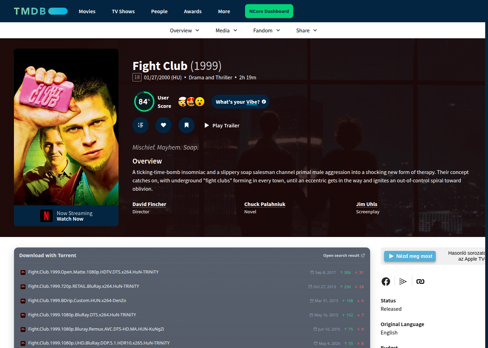
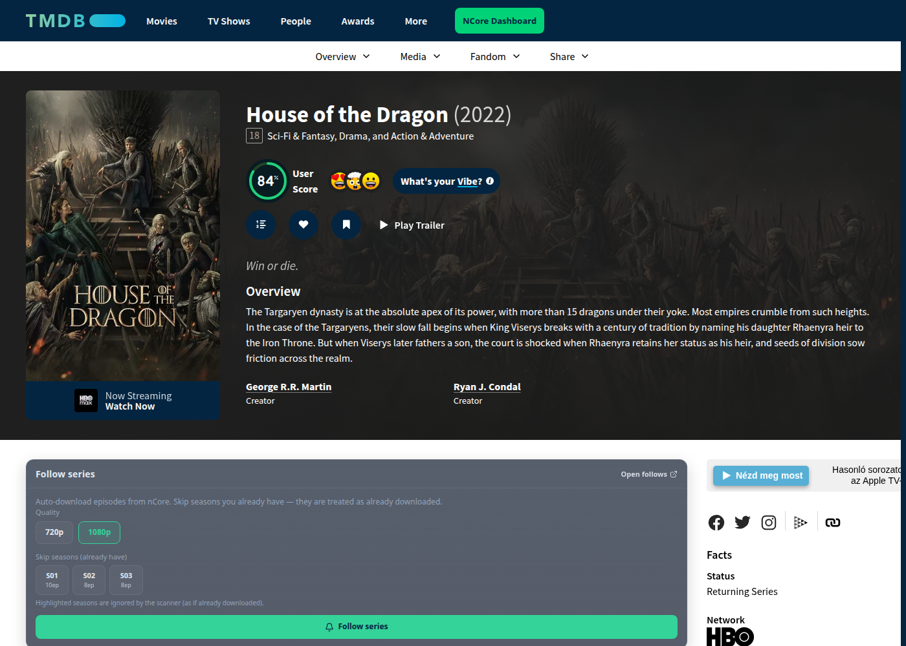
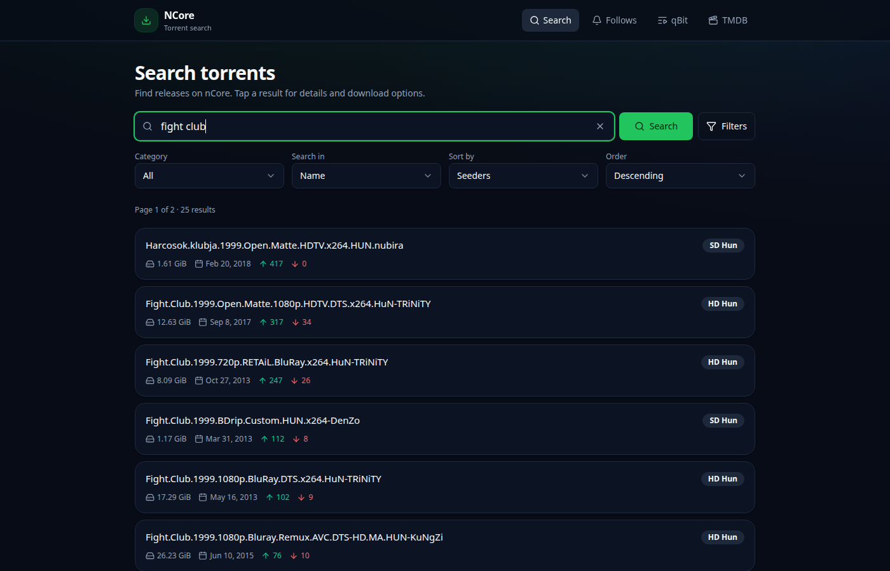
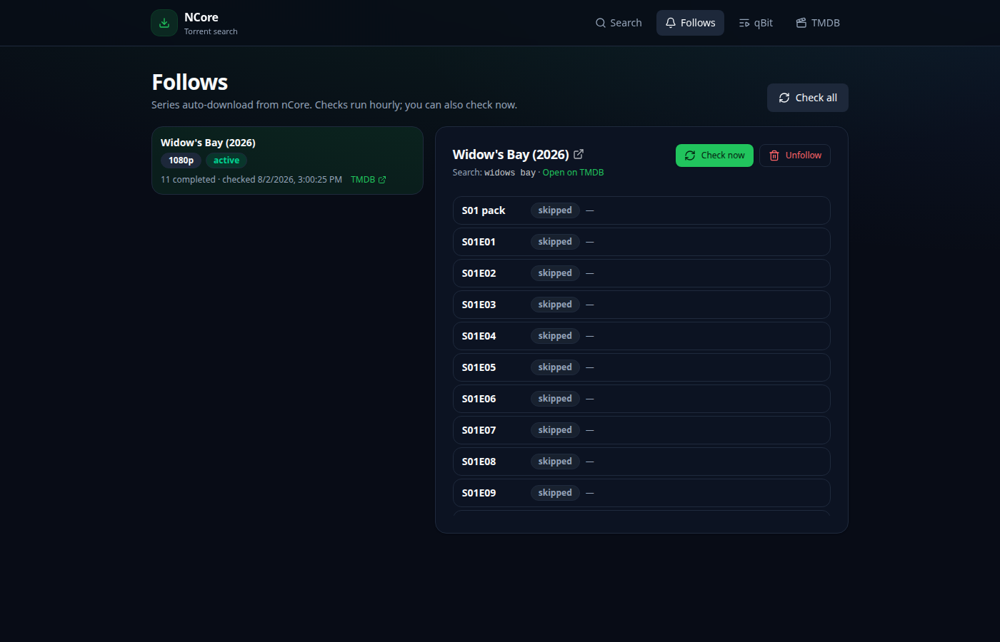

# ncore-tmdb

A self-hosted bridge between [The Movie Database](https://www.themoviedb.org), the nCore tracker, and qBittorrent — so you search, follow series, and grab releases without leaving one polished UI.

### Movies — torrents where you browse

Open any movie on your TMDB proxy. A **Download with Torrent** panel lists nCore releases with seeders, size, and one-click open in the dashboard.

<p align="center">
  
</p>

### Series — follow once, grab forever

On a TV show page, pick **720p / 1080p**, skip seasons you already own, and hit **Follow series**. The service checks nCore hourly for `S01E01`-style episodes and full season packs.

<p align="center">
  
</p>

### NCore Dashboard — search that feels modern

A dark, fast React app at `/ncore`: filters, categories, seeders, and detail pages that send straight to qBittorrent.

<p align="center">
  
</p>

### Follows — your series command center

See every show you’re tracking, run a manual check, jump back to TMDB, and inspect what was found or still missing.

<p align="center">
  
</p>

## Highlights

| Feature | What you get |
|--------|----------------|
| **TMDB proxy** | Familiar browse experience, enhanced with download tools |
| **Movie widget** | Instant nCore matches on the page |
| **Series follow** | Quality choice, skip seasons, hourly scan, season-pack upgrades |
| **NCore SPA** | Search, torrent detail, follows, qBit queue |
| **One binary** | Frontends built and embedded — deploy a single Go binary |

## Quick start

**Requirements:** Docker (or Go + Bun), nCore account, TMDB API key, qBittorrent.

```bash
# Configure
cp .env.example .env   # or create .env with your keys
# TMDB_API_KEY=...
# NCORE_USER=...
# NCORE_PASS=...
# NCORE_HOST=http://ncore:8080   # or your ncore-go API

# Run the stack
docker compose up -d --build

# Open
# TMDB proxy:  http://localhost:8080
# NCore app:   http://localhost:8080/ncore
```

Local build without Docker:

```bash
make          # bun frontends + go binary
./bin/ncore-tmdb
```
